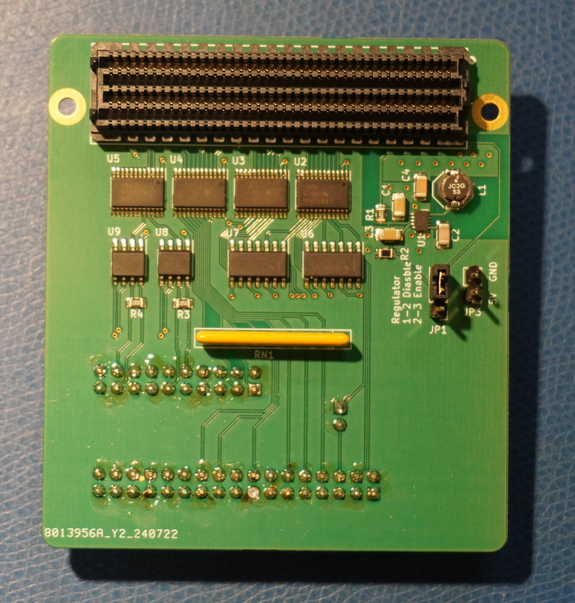
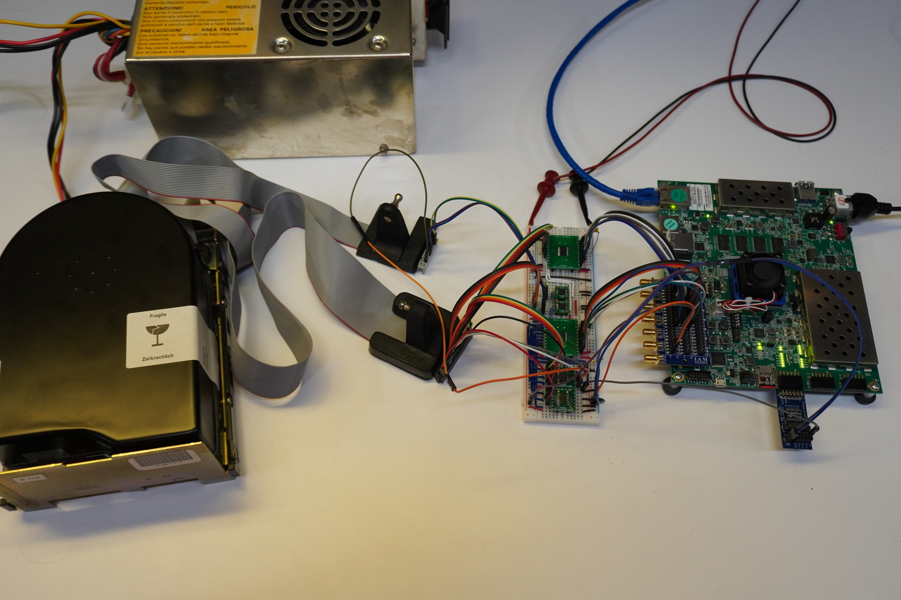

# A Zynq Based ESDI Disk Interface

The immediate goal of this project is to create a solution for reading data off old ESDI hard drives. At the moment it is capable of reading disk formatted by a couple of controllers, with retry logic, to create an image. More work needs to be done to increase confidence in its results.

I have made a PCB which allows me to connect a drive to my dev kit. It is an FMC based design, so unfortunately it only connects to dev boards which are over kill for this application. Nevertheless, the design files can be found under `esdi_fmc`
Eventually, I'd like to create a PCB that can accompany a cheaper (hopefully significantly) dev board than the one I'm using. In the meantime, someone with prior Zynq experience should not have much trouble moving the design to a different board.

### Todo:
* Read the defect table
* Add support for more formats.
* Make sector timings more dynamic/adaptive. At the very least it needs to consider the drive's data rate.
* Figure out an abstracted way to handle relocated sectors.

## License

This program is free software: you can redistribute it and/or modify it under the terms of the GNU General Public License as published by the Free Software Foundation, either version 2 of the License, or (at your option) any later version.

This program is distributed in the hope that it will be useful, but WITHOUT ANY WARRANTY; without even the implied warranty of MERCHANTABILITY or FITNESS FOR A PARTICULAR PURPOSE. See the GNU General Public License for more details.

You should have received a copy of the GNU General Public License along with this program. If not, see <https://www.gnu.org/licenses/>.
